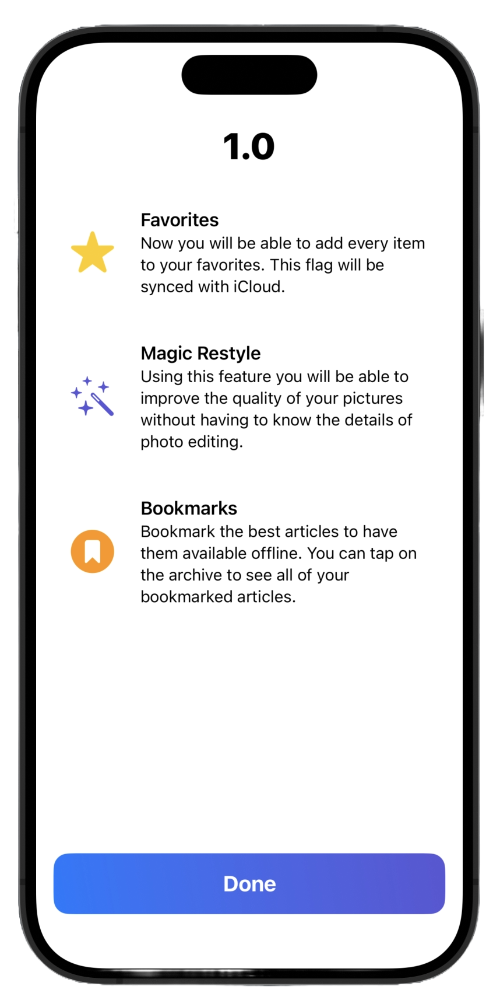

<p align="center">
    
</p>

<h1 align="center">
    ChangelogKit
</h1>


A Swift package designed to easily show the new features of your app.

### Why

I had the need to develop a view to showcase the new features of my app and I did not want to rely on something external. This is why I deveoped ChangelogKit.
Take this as is and use it as you want. 

### Information

This is developed for SwiftUI and the minimum iOS target is iOS 17. The code is fully documented using the Xcode markup. 

### How to use it

You create a `Changelog` object that is then passed to the `ChangelogView` that will render it. 
A changelog is composed of: 
- title (that will be visible on top of the `ChangelogView`)
- version (used as a title in case title is nil)
- set of features

A `Feature` has these properties:
- symbol that is a `String` and is the image shown on the left of a feature
- title
- description
- color that is used as a tint for the symbol

There is also the possibility to style the view. You can check the `ChangelogView.Style` structure to learn more about it. 

There is also a handy modifier to show the changelog view, using `changelogView(changelog:style:show:onDismiss:)`. 

### Example

#### Use ChangelogsCollectionProvider

`ChangelogsCollectionProvider` is a protocol and is the preferred way to deal with `ChangelogKit`. Passing it to the `showCurrentChangelogIfNeeded(...)` modifier will allow to show the right changelog for the current version. The version in the Info.plist file and in the `version` property of the changelog must be the same to make this mechanism works.

This is an example of how to use it: 

This is the `ChangelogsProvider` structure.

```swift
struct ChangelogsProvider: ChangelogsCollectionProvider {
    
    var changelogs: [Changelog] {
        [
            Changelog.init(
                version: "1.0",
                features: [
                    Changelog.Feature(symbol: "star.fill", title: "Favorites", description: "Now you will be able to add every item to your favorites. This flag will be synced with iCloud."),
                    Changelog.Feature(symbol: "wand.and.stars", title: "Magic Restyle", description: "Using this feature you will be able to improve the quality of your pictures without having to know the details of photo editing.", color: .indigo),
                    Changelog.Feature(symbol: "bookmark.circle.fill", title: "Bookmarks", description: "Bookmark the best articles to have them available offline. You can tap on the archive to see all of your bookmarked articles.", color: .orange),
                ]
            ),
            
            Changelog.init(
                version: "1.2",
                features: [
                    Changelog.Feature(symbol: "star.fill", title: "Favorites", description: "Now you will be able to add every item to your favorites. This flag will be synced with iCloud."),
                    Changelog.Feature(symbol: "wand.and.stars", title: "Magic Restyle", description: "Using this feature you will be able to improve the quality of your pictures without having to know the details of photo editing.", color: .indigo),
                    Changelog.Feature(symbol: "bookmark.circle.fill", title: "Bookmarks", description: "Bookmark the best articles to have them available offline. You can tap on the archive to see all of your bookmarked articles.", color: .orange),
                ]
            )
        ]
    }
}
```

This is the view where the provider is used. 

```swift
struct ContentView: View {
    
    @State private var isChangelogShown: Bool = false

    var body: some View {
        Button("Hello") {
            isChangelogShown.toggle()
        }
        .showCurrentChangelogIfNeeded(
            isPresented: $isChangelogShown,
            provider: ChangelogsProvider()
        )
    }
}
```

#### Init a ChangelogView and use it

This is how you can render a `ChangelogView`. This is the code: 

```swift
struct ContentView: View {
    
    @State private var isChangelogShown: Bool = false
    private let versioneOne: Changelog = Changelog.init(
        version: "1.0",
        features: [
            Changelog.Feature(symbol: "star.fill", title: "Favorites", description: "Now you will be able to add every item to your favorites. This flag will be synced with iCloud."),
            Changelog.Feature(symbol: "wand.and.stars", title: "Magic Restyle", description: "Using this feature you will be able to improve the quality of your pictures without having to know the details of photo editing.", color: .indigo),
            Changelog.Feature(symbol: "bookmark.circle.fill", title: "Bookmarks", description: "Bookmark the best articles to have them available offline. You can tap on the archive to see all of your bookmarked articles.", color: .orange),
        ]
    )

    var body: some View {
        Button("Hello") {
            isChangelogShown.toggle()
        }
        .sheet(isPresented: $isChangelogShown, changelog: versionOne)
    }
}
```


This is how a `ChangelogView` will be rendered. 

<p align="center">
    
</p>
