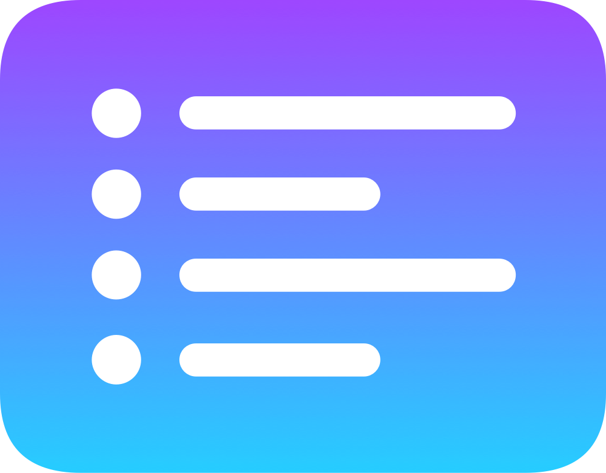
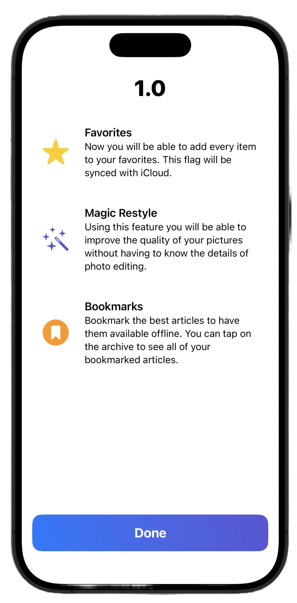

<p align="center">
    
</p>

<h1 align="center">
    ChangelogKit
</h1>

A Swift package for displaying "What's New" changelog screens in iOS apps. Zero external dependencies.

### Requirements

- iOS 17+
- Swift 5.9+

### Why

I needed a lightweight, native SwiftUI view to showcase new features in my apps without relying on external dependencies. ChangelogKit is the result.

### Installation

Add the package via Swift Package Manager using the repository URL.

---

### Core Concepts

#### `Changelog`

Represents the changelog for a specific version of your app.

```swift
Changelog(version: "2.0", features: [
    Changelog.Feature(
        symbol: "star.fill",
        title: "Favorites",
        description: "Add any item to your favorites. Synced with iCloud.",
        color: .yellow,
        pinBehavior: .untilMinorChanges
    )
])
```

> `title` on `Changelog` is deprecated as of v2.0. The view always shows the localized "What's New" heading.

#### `Changelog.Feature`

A single entry in a changelog.

| Property | Type | Description |
|----------|------|-------------|
| `symbol` | `String` | SF Symbol name |
| `title` | `String` | Feature title |
| `description` | `String` | Feature description |
| `color` | `Color?` | Tint color for the symbol icon |
| `pinBehavior` | `PinBehavior` | Controls visibility in the pinned highlights section |

#### `Changelog.Feature.PinBehavior`

Controls how long a feature appears in the "Highlights" section across version updates.

```swift
enum PinBehavior {
    case never              // never shown in highlights (default)
    case untilPatchChanges  // shown while major.minor.patch matches
    case untilMinorChanges  // shown while major.minor matches — survives hotfixes
    case untilMajorChanges  // shown while major matches — survives minor/patch updates
    case always             // always shown until removed by the developer
}
```

---

### Usage

#### Option 1 — `ChangelogsCollectionProvider` (recommended)

Implement the protocol to manage your full changelog history. The framework handles version tracking via `UserDefaults` and automatically computes which features to pin.

```swift
struct ChangelogsProvider: ChangelogsCollectionProvider {

    var changelogs: [Changelog] {
        [
            Changelog(version: "1.0", features: [
                Changelog.Feature(
                    symbol: "star.fill",
                    title: "Favorites",
                    description: "Add any item to your favorites. Synced with iCloud.",
                    color: .yellow,
                    pinBehavior: .untilMinorChanges
                ),
                Changelog.Feature(
                    symbol: "wand.and.stars",
                    title: "Magic Restyle",
                    description: "Improve photo quality automatically.",
                    color: .indigo
                )
            ]),

            Changelog(version: "2.0", features: [
                Changelog.Feature(
                    symbol: "sparkles",
                    title: "Highlights",
                    description: "Pinned features from previous versions are now shown at the top.",
                    color: .orange,
                    pinBehavior: .untilMajorChanges
                )
            ])
        ]
    }
}
```

Use the `.showCurrentChangelogIfNeeded` modifier to present the changelog automatically once per version:

```swift
struct ContentView: View {

    @State private var isChangelogShown = false

    var body: some View {
        Button("Show changelog") {
            isChangelogShown.toggle()
        }
        .showCurrentChangelogIfNeeded(
            isPresented: $isChangelogShown,
            provider: ChangelogsProvider()
        )
    }
}
```

The modifier automatically:
- matches the current app version (from `CFBundleShortVersionString`)
- tracks already-displayed versions in `UserDefaults`
- passes the computed `pinnedFeatures` to the view

#### Option 2 — Manual `ChangelogView`

Present a specific changelog directly:

```swift
struct ContentView: View {

    @State private var isChangelogShown = false

    private let changelog = Changelog(version: "2.0", features: [
        Changelog.Feature(
            symbol: "sparkles",
            title: "Highlights",
            description: "Pinned features from previous versions are now shown at the top.",
            color: .orange
        )
    ])

    var body: some View {
        Button("Show changelog") {
            isChangelogShown.toggle()
        }
        .sheet(isPresented: $isChangelogShown, changelog: changelog)
    }
}
```

---

### Styling

Customize the appearance via `ChangelogView.Style`:

```swift
let style = ChangelogView.Style(
    view: .init(
        spacingBetweenSections: 24,
        spacingBetweenHeaderAndCard: 8,
        spacingBetweenFeatures: 8,
        contentPadding: 12
    ),
    features: .init(
        titleFont: .headline,
        descriptionFont: .subheadline,
        titleTextColor: Color(UIColor.label),
        descriptionTextColor: Color(UIColor.secondaryLabel)
    ),
    primaryAction: .init(
        title: nil,             // nil = localized "Continue"
        hidden: false,
        font: .title3.weight(.bold),
        useCapsuleAsShape: true,
        cornerRadius: 14,
        backgroundColor: .accentColor,
        backgroundGradient: nil,
        textColor: .white
    ),
    card: .init(
        backgroundColor: Color(UIColor.secondarySystemBackground),
        cornerRadius: 16,
        shadowColor: .clear,
        shadowRadius: 0,
        shadowOffset: .zero
    ),
    featureIcon: .init(
        size: 24,
        containerShape: .roundedSquare(radius: 10),  // .circle / .roundedSquare(radius:) / .none
        containerSize: 44,
        containerColor: Color(UIColor.tertiarySystemBackground)
    ),
    sectionHeader: .init(
        font: .caption.weight(.semibold),
        color: Color(UIColor.secondaryLabel),
        uppercased: true,
        pinnedTitle: nil,           // nil = localized "Highlights"
        currentVersionTitle: nil    // nil = automatic "Version X.Y.Z"
    ),
    featureDivider: .init(
        visible: true,
        color: Color(UIColor.separator)
    )
)
```

Pass the style to any presenter:

```swift
.sheet(isPresented: $show, changelog: changelog, style: style)
.showCurrentChangelogIfNeeded(isPresented: $show, provider: provider, style: style)
```

---

### Screenshot

<p align="center">
    
</p>
